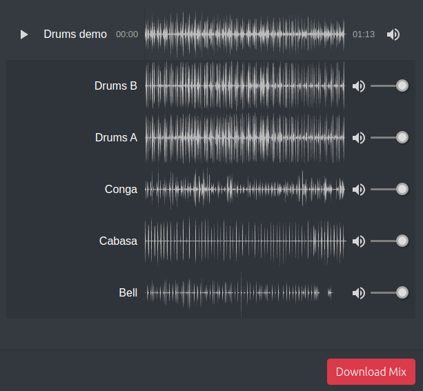

# @sound-ws/stems-player-documentation

The Sound Web Services Stems Player is a music player for use in the browser which is capable of playing multiple stems offering the user to control the volumes of each stem. When used together with the Sound Web Services Audio Service, this volume configuration can then be used in order to mix high quality WAV files.

See [this live example](https://www.sound.ws/stems)

## HOW DOES IT WORK

Once the Stems Player component is instantiated in the browser, it will be instructed to play a set of audio files. The player uses the [HTTP live streaming protocol](https://en.wikipedia.org/wiki/HTTP_Live_Streaming). This, briefly, works by serving pre-segmented audio file into segments (of e.g. 10 seconds), and an index (m3u8) file containing information (such as the duration & start-time of each segment) alongside the audio. Communication between the Stems Player and the audio files is direct between browser and wherever the audio is hosted (e.g. a CDN like AWS Cloudfront), meaning that no additional infrastructure is required for the playing the audio, and the player can benefit from the power and scalability offered by such CDN’s. In addition, because communication between player and audio-source is simply http traffic, this communication can traverse any firewall that allows standard http traffic - as oposed to (for example) web-socket which can sometimes be blocked by corporate firewalls or anti-virus software.

The volume configuration can then be extracted from the Stems Player browser component and sent to the Audio Service where it can be used to generate a high quality (WAV) file.

Please see the following documents for more infomation:

- [The stems player browser component](stems-player-component.md)
- [Installing the audio service (self-hosted)](audio-service.md)
- [Integrating the audio-service your backend](integration.md)

## Licence

Copyright (C) Sound Web Services LTD - All Rights Reserved

The Stems Player and the Audio Service is available under a commercial licence.

Please contact us at licensing@sound.ws for inquiries.
