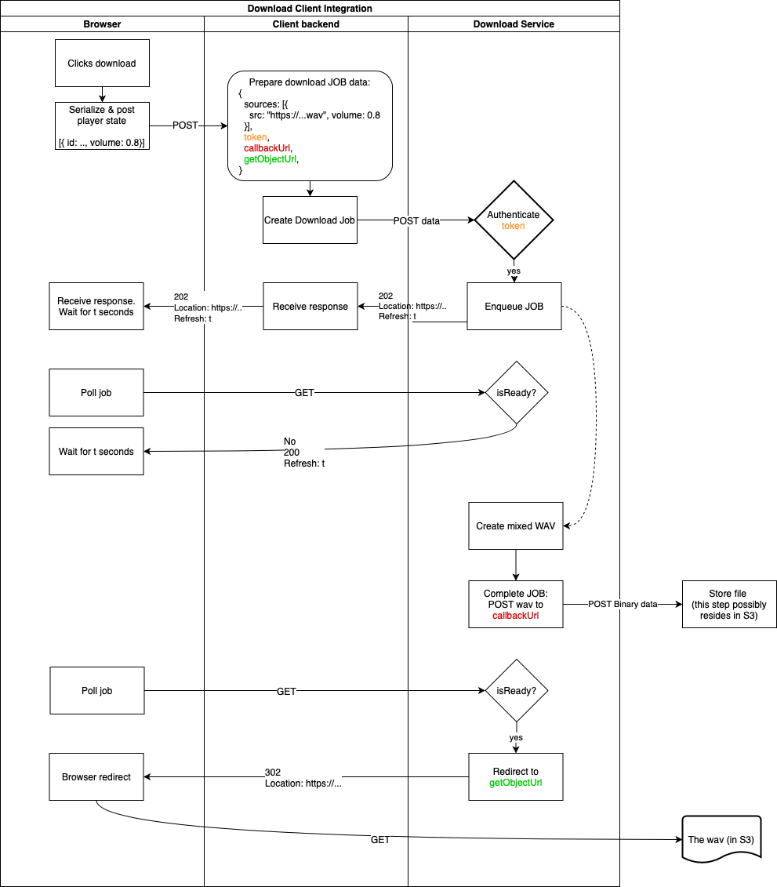

# Integrating the audio-service your backend

The diagram below shows the flow of the download process. To summarise, the user clicks download. The volume configuration is extracted from the Stems Player component and sent to the client’s backend. This backend is then responsible for

1. creating a signed url for each stem giving access to a high quality WAV version of that stem which is to be used to create the mix;
2. generating a callback url to which the mixed WAV is eventually sent (via HTTP Post request);
3. a url giving access to the mixed stem (so that the browser can be redirected to this resource at the end of the mixing process);
4. a JWT token to authenticate the request

This data is then sent to the download API and the request is authenticated using the token described in (4). The download API will respond with instructions which allow the player component to automatically poll a “status” endpoint to determine whether the mixing process has completed. When the mixing process starts, the audio service will download the WAV files described in
(1). Once the mixing is complete it will post the file back to the url described in (2). When the mix is ready the player will automatically redirect to the url described in (3) and the download will be
triggered.

We have created an [example repository](https://github.com/sound-ws/stems-player-example) which shows the working of the Stems Player Component and how it can integrate with the Audio Service. In relation to the above see especially [this example](https://github.com/sound-ws/stems-player-example/blob/master/examples/server/handle-download.js).

The complexity involved in having the browser poll the audio service until the mix is ready can be dealt with by using the [Audio Service Client](https://github.com/sound-ws/audio-service-client)
